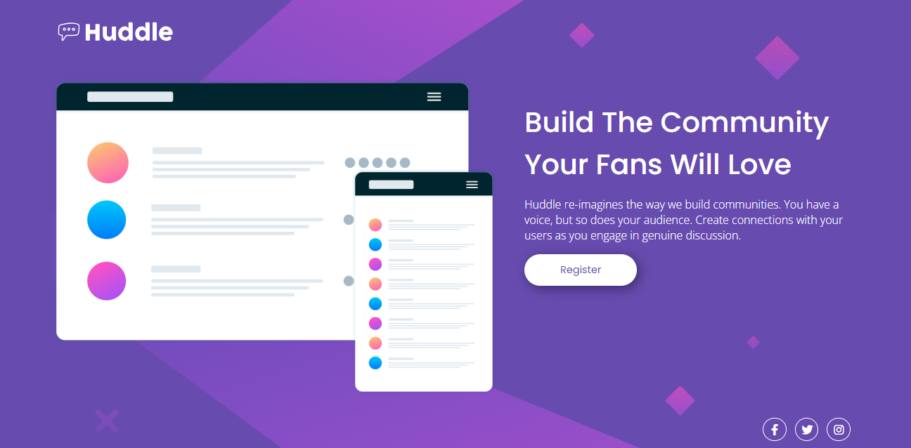

# Projeto usando flex-box!

## Esse projeto tem como base colocar em pratica o flex box e o alguns outras propriedades aprendidas.

<h3> Design para desktop: </h3>

<h3>Botões ativos com hover:</h3>

<h3> Design para mobile: </h3>

